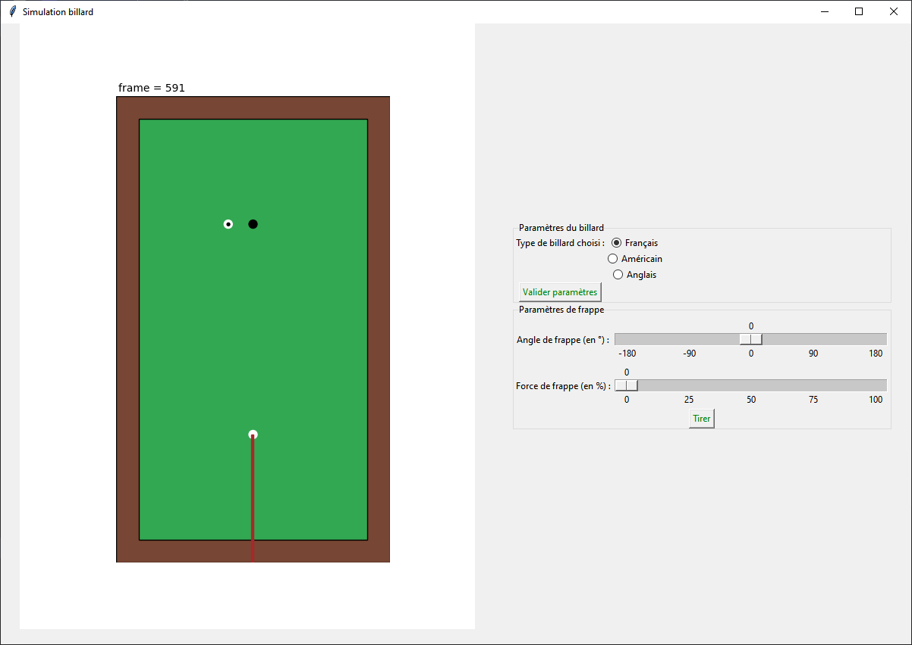

## Coding Week 2023-2024 - Billard Interactif Techniquement Exploitable

## :clipboard: Description 
Simulation et affichage d'un billard interactif :8ball:

## :construction_worker: Membres 
- Montoya Samuel
- Delavaud Paul-Emile
- Faynot Guillaume
- Noël-Bertin Paul
- Talbaut Gatien

## :books: Bibliothèques 

Installation des bibliothèques:
```bash
pip install -r requirements.txt
```
## :chart_with_upwards_trend: Lancement de la simulation 
Après avoir installé les bibliothèques requises, taper dans un terminal la commande suivante:
```bash
launch_billard.py 
```

Une fenêtre va s'ouvrir avec à gauche le billard, à droite un cadre d'intéraction.
Le haut du cadre permet de changer le type de jeu (billard français, anglais ou américain).
Le bas du cadre permet de paramétrer notre coup (force, direction) et de l'executer.



## :loudspeaker: Soutenance 
Le support de présentation pour la présentation est accessible [ici](WorkingDocs/presentation.pdf) :point_left:
## :construction: Détails du projet 
### Analyse et Conception du produit
Le travail préalable servant à établir les objectifs de notre projet est amorcé par :
- une étude du lanquage omniprésent ou [ubiquitous language](WorkingDocs/ubiquitous%20language.md) dans le but de déterminer un vocabulaire commun
- une analyse des besoins d'un utilisateur en imagninant des scénarios d'utilisation et [user stories](WorkingDocs/user%20story.md)

### Analyse du problème et des principales fonctionnalités MVP :
- Permettre à l’utilisateur d'interagir avec le billard et régler un tir : choix de la direction et de la puissance du coup
- Permettre la simulation et la visualisation du coup (en 2D vue du dessus) en fonction des paramètres renseignés par l’utilisateur : déplacements, rebonds, collisions
- Afficher la simulation sous la forme d’une animation à l’aide du module matplotlib

### Fonctionnalités supplémentaires :
- Permettre le choix du point d’impact sur la boule frappée avec la queue (affichage de la boule vue depuis la queue sur un 2ème affichage)
- Appliquer les conséquences des différents effets causés par ce choix (rotation de la boule, etc.) à la simulation (effets : rétro, coulé, etc.)
- Modéliser des frottements (résistance au roulement et au glissement)
Intégrer la possibilité de jouer une partie de billard français/américain/anglais
- Ajouter des trous à la table de billard 

### Détails des fonctionnalités : 
#### Objectif 1 : MVP
- **:white_check_mark: Sprint 1 : mise en place du modèle du billard**
    - :heavy_check_mark: Fonctionnalité 1 : représentation d’une table de billard et d’une boule
    - :heavy_check_mark: Fonctionnalité 2 : affichage du billard et d’une boule avec `matplotlib`
- **:white_check_mark: [Sprint 2](WorkingDocs/gif/sprint2-rebond.gif) : mise en place du mouvement libre au sein du billard**
    - :heavy_check_mark: Fonctionnalité 3 : simulation du mouvement d’une boule initié par un coup frappé avec la queue
    - :heavy_check_mark: Fonctionnalité 4 : modélisation les interactions entre la boule et le bord de la table de billard (rebonds)
    - :heavy_check_mark: Fonctionnalité 5 : Mise à jour de la position des boules en fonction de la vitesse
- **:white_check_mark: [Sprint 3](WorkingDocs/gif/sprint3-colision.gif) : mise en place des interactions entre les boules**
    - :heavy_check_mark: Fonctionnalité 6 : modélisation du choc entre les boules
- **:white_check_mark: Sprint 4 : Paramétrer la simulation depuis une ligne de commande**
    - :heavy_check_mark: Fonctionnalité 7 : utilisation du module argparse
    - :heavy_check_mark: Fonctionnalité 8 : écriture d’un programme principal
    - :heavy_check_mark: Fonctionnalité 9 : lancement d’un coup

#### Objectif 2 : un jeu complet
- **Sprint 7 : Utilisation d’un GUI**
    - :heavy_check_mark: Fonctionnalité 10 : mise en place d'une interface graphique pour lancer un coup "in-game"
    - :heavy_check_mark: Fonctionnalité 11 : gestion d'une partie de billard

#### Objectif 3 : Ajout des rotations dans notre _"moteur physique"_
- **:white_check_mark: [Sprint 5](WorkingDocs/gif/objectif3-pymunk.gif) : Rotation dans les axes du plan (x et y) sous `pymunk`**
    - :heavy_check_mark: Fonctionnalité 12 : Création d'un billard fonctionnel avec `pymunk`
    - :heavy_check_mark: Fonctionnalité 13 : Prise en compte de la rotation de la boule sur ses axes x et y
    - :heavy_check_mark: Fonctionnalité 14 : Ajout des forces de frottement et de résistance au roulement avec le tapis
- **Sprint 6 : Rotation sur trois axes pour notre _"moteur physique"_**
    - :heavy_check_mark: Fonctionnalité 13' : Portage de la rotation de la boule sur ses axes x et y
    - :heavy_check_mark: Fonctionnalité 14' : Portage des forces de frottement et de résistance au roulement avec le tapis
    - Fonctionnalité 15 : Ajout de la rotation suivant l'axe z (modification des rebonds)
    - Fonctionnalité 16 : Possibilité de frapper la boule blanche pour produire un effet (point d'impact paramétrable)
